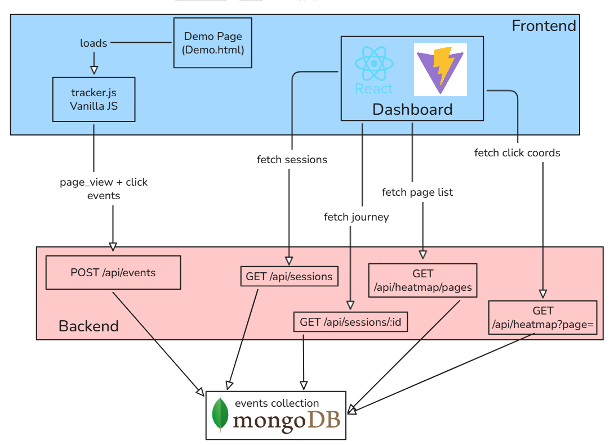

# TrackFlow

A full-stack user analytics application built for the **CausalFunnel Full Stack Engineer Assignment**.

TrackFlow captures user interactions on a webpage, stores events in MongoDB, and provides an analytics dashboard to visualize user sessions, event journeys, and click heatmaps.

---

# Live Demo

### Frontend

https://trackflow-zeta-two.vercel.app/

### Backend

https://trackflow-podh.onrender.com

---

# Features

## Event Tracking SDK

A lightweight JavaScript tracking script that can be embedded into any webpage.

Tracks:

* page_view events
* click events

Each event contains:

* session_id
* event_type
* page_url
* timestamp
* x coordinate
* y coordinate

Events are automatically sent to the backend API.

---

## Sessions Dashboard

* View tracked sessions
* Total event count per session
* User journey timeline
* Ordered session events

---

## Heatmap Dashboard

* Select a tracked page URL
* View click positions
* Visual click heatmap representation

---

## Demo Page

A standalone demo page is included to test tracking behavior.

Users can:

* Generate page views
* Generate click events
* View session analytics
* Test heatmap functionality

---

# System Architecture



---
# Tech Stack
## Technology Choices

| Layer | Technology | Reason for Selection |
|---------|------------|----------------------|
| Frontend | React 19 + Vite + Tailwind CSS | Enables rapid development, reusable UI components, and efficient styling |
| Backend | Node.js + Express.js | Provides a lightweight and scalable REST API architecture |
| Database | MongoDB Atlas + Mongoose | Supports flexible event storage and efficient aggregation queries |
| Tracker SDK | Vanilla JavaScript | Zero dependencies, easy integration into any website |
| HTTP Communication | Axios | Simplifies API requests and error handling |
| Routing | React Router | Enables seamless navigation between dashboard views |
| Frontend Hosting | Vercel | Optimized deployment workflow for React/Vite applications |
| Backend Hosting | Render | Reliable hosting for Express applications |
| Source Control | Git & GitHub | Version tracking and project collaboration |
## Deployment

* Vercel
* Render
* MongoDB Atlas

---

# API Endpoints
| Method | Endpoint | Description |
|----------|----------|-------------|
| POST | `/api/events` | Receives and stores tracked events (page_view, click) in MongoDB |
| GET | `/api/sessions` | Returns all sessions with their total event counts |
| GET | `/api/sessions/:sessionId` | Returns all events for a specific session ordered by timestamp |
| GET | `/api/heatmap/pages` | Returns a list of unique tracked page URLs |
| GET | `/api/heatmap?page=<page_url>` | Returns click coordinates for the selected page to generate the heatmap |
---

# Local Setup

## Prerequisites

Make sure the following tools are installed on your system:

| Tool | Version |
|--------|---------|
| Node.js | v18+ |
| npm | v9+ |
| MongoDB Atlas Account | Latest |
| Git | Latest |

Verify installation:

```bash
node -v
npm -v
git --version

## Clone Repository

```bash
git clone https://github.com/Rohit03022006/trackflow.git

cd trackflow
```

---

# Backend Setup

```bash
cd backend

npm install
```

Create:

```env
PORT=5000

MONGODB_URI=your_mongodb_connection_string
```

Start server:

```bash
npm start
```

Backend runs on:

```text
http://localhost:5000
```

---

# Frontend Setup

```bash
cd frontend

npm install
```

Create:

```env
VITE_API_URL=http://localhost:5000/api
```

Run:

```bash
npm run dev
```

Frontend runs on:

```text
http://localhost:3000
```

---

# Testing Guide

## Demo Page

Open:

```text
http://localhost:3000/demo.html
```

### Steps

1. Open demo page
2. Generate page_view event
3. Click buttons and content areas
4. Open dashboard
5. View Sessions
6. Open Event Journey
7. Open Heatmap
8. Verify click positions

---

# Deployment

## Frontend

Hosted on Vercel.

## Backend

Hosted on Render.

## Database

MongoDB Atlas.

---

## Assumptions & Trade-offs

| Decision | Rationale |
|-----------|-----------|
| **localStorage for session_id** | Simple and sufficient for tracking sessions in this assignment. |
| **No Authentication** | Kept out of scope to focus on analytics functionality. |
| **Heatmap uses click coordinates** | Lightweight implementation that satisfies assignment requirements. |
| **Open CORS Policy** | Enabled for development convenience; should be restricted in production. |
| **No Pagination** | Dataset is expected to be small for the assignment scope. |
| **Vanilla JavaScript Tracker** | Easy to integrate into any webpage with a single script tag. |
